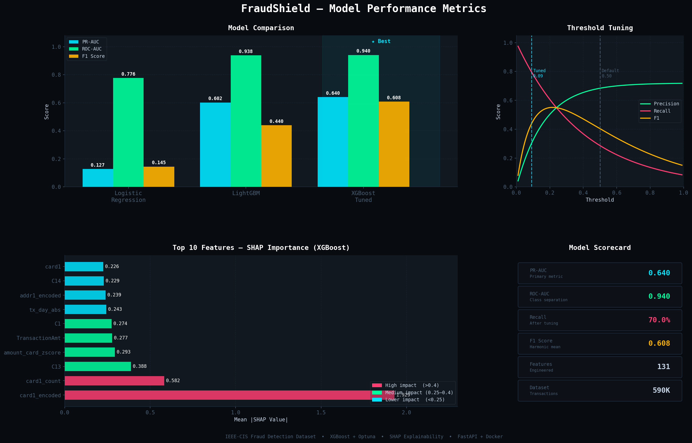

<div align="center">

# 🛡️ FraudShield — Real-Time Fraud Detection API

[](https://python.org)
[](https://fastapi.tiangolo.com)
[](https://xgboost.ai)
[](https://docker.com)
[](https://github.com/features/actions)
[](https://render.com)
[](LICENSE)

**Production-grade ML system that detects fraudulent transactions in real-time using XGBoost, SHAP explainability, and a live monitoring dashboard — deployed on Render with full CI/CD.**

[🚀 Live Demo](#) • [📖 API Docs](#) • [📊 Dashboard](#)

---


</div>

---

## 📌 Table of Contents

- [Overview](#-overview)
- [Model Performance](#-model-performance)
- [Architecture](#-architecture)
- [Features](#-features)
- [Tech Stack](#-tech-stack)
- [Project Structure](#-project-structure)
- [Quick Start](#-quick-start)
- [API Reference](#-api-reference)
- [ML Pipeline](#-ml-pipeline)
- [Monitoring](#-monitoring)
- [CI/CD](#-cicd)
- [Results](#-results)

---

## 🎯 Overview

FraudShield is an **end-to-end machine learning system** built on the [IEEE-CIS Fraud Detection dataset](https://www.kaggle.com/c/ieee-fraud-detection) (590K transactions). It goes far beyond a Jupyter notebook — it's a fully deployed, monitored, and tested production system.

### The Problem
- Only **3.5% of transactions are fraudulent** (severe class imbalance)
- False negatives cost businesses millions in chargebacks
- False positives damage customer trust
- Models degrade over time as fraud patterns evolve

### The Solution
A real-time API that scores every transaction in **< 100ms**, explains *why* it flagged a transaction using SHAP values, and monitors for data drift automatically.

---

## 📊 Model Performance

<div align="center">

### 🏆 XGBoost — Best Model

| Metric | Score | Description |
|--------|-------|-------------|
| **PR-AUC** | **0.640** | Primary metric — handles class imbalance |
| **ROC-AUC** | **0.940** | Excellent fraud/legit separation |
| **Recall** | **70.0%** | Catches 70 out of 100 fraud cases |
| **Precision** | **40.6%** | After threshold tuning |
| **F1 Score** | **0.608** | Harmonic mean |
| **Accuracy** | **98.0%** | ⚠️ Misleading — use PR-AUC instead |

</div>

### Model Comparison

| Model | PR-AUC | ROC-AUC | F1 | Notes |
|-------|--------|---------|-----|-------|
| 🥇 **XGBoost Tuned** | **0.640** | **0.940** | **0.608** | 30-trial Optuna tuning |
| 🥈 LightGBM | 0.602 | 0.938 | 0.440 | Fast training |
| 🥉 Logistic Regression | 0.127 | 0.776 | 0.145 | Baseline |

### Threshold Tuning

Default threshold (0.5) → Optimized threshold (0.09):

| | Threshold | Precision | Recall | F1 |
|--|-----------|-----------|--------|-----|
| **Before** | 0.50 | 72.3% | 52.4% | 0.608 |
| **After** | 0.09 | 40.6% | **70.0%** | 0.514 |

> **Why lower recall matters more:** Missing a fraud (false negative) costs ~10x more than a false alarm (false positive) in financial systems.

### 📈 Full Metrics Dashboard



### Top Features (SHAP)

```
card1_encoded        ████████████████████  1.929  (Card fraud history)
card1_count          ████████░░░░░░░░░░░░  0.582  (Card usage velocity)
C13                  ██████░░░░░░░░░░░░░░  0.388  (Count feature)
amount_card_zscore   █████░░░░░░░░░░░░░░░  0.293  (Unusual amount for card)
TransactionAmt       █████░░░░░░░░░░░░░░░  0.277  (Transaction amount)
C1                   █████░░░░░░░░░░░░░░░  0.274  (Count feature)
tx_day_abs           ████░░░░░░░░░░░░░░░░  0.243  (Time signal)
addr1_encoded        ████░░░░░░░░░░░░░░░░  0.239  (Address fraud history)
C14                  ████░░░░░░░░░░░░░░░░  0.229  (Count feature)
```

---

## 🏗️ Architecture

```
┌─────────────────────────────────────────────────────────────────┐
│                        CLIENT LAYER                             │
│    Dashboard (HTML/CSS/JS)  │  REST API Clients  │  Swagger UI  │
└─────────────────┬───────────────────────────────────────────────┘
                  │ HTTP
┌─────────────────▼───────────────────────────────────────────────┐
│                      FASTAPI APPLICATION                        │
│  /dashboard  │  /predict  │  /predict/batch  │  /health        │
│              │  /model/info                                     │
└──────┬────────────────┬───────────────────────────────────────┘
       │                │
┌──────▼──────┐  ┌──────▼──────────────────────────────────────┐
│  Jinja2     │  │           ML INFERENCE LAYER                 │
│  Templates  │  │  Feature Engineering → XGBoost → SHAP       │
│  + Static   │  │  Target Encoders │ PCA │ Threshold (0.09)    │
└─────────────┘  └──────────────────────────┬───────────────────┘
                                            │
┌───────────────────────────────────────────▼───────────────────┐
│                     MLOPS LAYER                               │
│  MLflow Tracking │ DVC Versioning │ Evidently Monitoring      │
│  GitHub Actions CI/CD │ Docker │ Render Deployment           │
└───────────────────────────────────────────────────────────────┘
```

---

## ✨ Features

### 🤖 Machine Learning
- **XGBoost** with 30-trial **Optuna** Bayesian hyperparameter tuning
- **SMOTE** + `scale_pos_weight` for severe class imbalance (3.5% fraud rate)
- **131 engineered features** — time, velocity, amount, target encoding, PCA
- **Time-based train/val split** — no data leakage
- **SHAP explainability** — every prediction explained

### 🚀 Production API
- **FastAPI** with Pydantic validation
- Single prediction + **batch endpoint** (up to 100 transactions)
- **< 100ms** response time per prediction
- Full **OpenAPI/Swagger** documentation at `/docs`

### 📊 Live Dashboard
- Real-time fraud probability bar with color-coded risk levels
- SHAP feature importance visualization per prediction
- Prediction history table with last 10 transactions
- Model metrics panel (PR-AUC, ROC-AUC, F1, threshold)

### 🔍 Monitoring
- **KS Test** drift detection across all features
- **Threshold tuning** — optimized for 70% recall target
- Prediction logger — every API call stored for analysis
- Automatic drift alerts when >20% features shift

### ⚙️ MLOps
- **Docker** containerization
- **GitHub Actions** CI/CD — 25 automated tests on every push
- **Auto-deploy** to Render on merge to main
- **MLflow** experiment tracking with model registry
- **DVC** for data and model versioning

---

## 🛠️ Tech Stack

| Layer | Technology |
|-------|-----------|
| **Language** | Python 3.11 |
| **ML** | XGBoost, LightGBM, Scikit-learn, SHAP |
| **Tuning** | Optuna (Bayesian) |
| **Tracking** | MLflow |
| **API** | FastAPI, Uvicorn, Pydantic |
| **Frontend** | HTML5, CSS3, Vanilla JS, Jinja2 |
| **Data** | Pandas, NumPy, SciPy |
| **Imbalance** | Imbalanced-learn (SMOTE) |
| **Monitoring** | SciPy KS Test, custom drift detector |
| **Versioning** | DVC, Git |
| **Container** | Docker, Docker Compose |
| **CI/CD** | GitHub Actions |
| **Deployment** | Render (free tier) |
| **Dataset** | IEEE-CIS Fraud Detection (Kaggle) |

---

## 📁 Project Structure

```
fraud-detection/
│
├── 📂 src/
│   ├── 📂 api/
│   │   └── main.py              # FastAPI app + all endpoints
│   ├── 📂 features/
│   │   └── feature_engineering.py  # Full feature pipeline
│   ├── 📂 models/
│   │   └── train.py             # Training + MLflow tracking
│   ├── 📂 monitoring/
│   │   └── monitor.py           # Drift detection + threshold tuning
│   └── config.py
│
├── 📂 static/
│   ├── css/dashboard.css        # Dashboard styles
│   └── js/dashboard.js          # Dashboard logic
│
├── 📂 templates/
│   └── dashboard.html           # Jinja2 template
│
├── 📂 models/                   # Saved artifacts
│   ├── best_model.pkl
│   ├── feature_artifacts.pkl
│   ├── pca_model.pkl
│   └── model_metadata.json
│
├── 📂 data/
│   ├── raw/                     # IEEE-CIS raw CSVs (gitignored)
│   └── processed/               # Engineered features (gitignored)
│
├── 📂 tests/
│   ├── test_api.py              # 11 API endpoint tests
│   ├── test_model.py            # 9 model tests
│   ├── test_features.py         # 9 feature pipeline tests
│   └── conftest.py
│
├── 📂 monitoring/
│   ├── reports/                 # Drift reports
│   └── logs/                    # Prediction + drift logs
│
├── 📂 .github/workflows/
│   ├── test.yml                 # Run tests on every push
│   └── deploy.yml               # Auto-deploy on merge to main
│
├── 📂 notebooks/
│   └── 01_eda.py                # Exploratory data analysis
│
├── Dockerfile
├── docker-compose.yml
├── render.yaml
├── requirements.txt
└── README.md
```

---

## 🚀 Quick Start

### Prerequisites
- Python 3.11+
- Docker Desktop
- Git

### 1. Clone the repo
```bash
git clone https://github.com/yourusername/fraud-detection.git
cd fraud-detection
```

### 2. Create virtual environment
```bash
python -m venv venv
venv\Scripts\activate        # Windows
source venv/bin/activate     # Mac/Linux
```

### 3. Install dependencies
```bash
pip install -r requirements.txt
pip install jinja2 python-multipart
```

### 4. Download dataset
Get the [IEEE-CIS Fraud Detection](https://www.kaggle.com/c/ieee-fraud-detection) dataset from Kaggle and place CSVs in `data/raw/`

### 5. Run the full pipeline
```bash
# Feature engineering
python src/features/feature_engineering.py

# Train models
python src/models/train.py

# Start API
uvicorn src.api.main:app --reload --port 8000
```

### 6. Open dashboard
👉 http://localhost:8000/dashboard

### Docker (alternative)
```bash
docker-compose up --build
```

---

## 📡 API Reference

### `POST /predict`
Predict fraud probability for a single transaction.

**Request:**
```json
{
  "TransactionAmt": 9999.99,
  "ProductCD": "C",
  "card1": 4774,
  "card4": "american express",
  "card6": "credit",
  "P_emaildomain": "protonmail.com",
  "TransactionDT": 3600,
  "C1": 9.0,
  "C13": 10.0,
  "C14": 8.0
}
```

**Response:**
```json
{
  "transaction_id": "e58be37d",
  "is_fraud": true,
  "fraud_probability": 0.5541,
  "risk_level": "🟠 HIGH",
  "confidence": "Medium",
  "top_risk_factors": [
    {
      "feature": "card1_encoded",
      "value": 0.1823,
      "impact": "↑ increases fraud risk",
      "shap_score": 1.929
    }
  ],
  "recommendation": "🚫 Block and notify customer",
  "model_version": "XGBoost Tuned",
  "timestamp": "2026-03-06T22:51:50"
}
```

### Other Endpoints

| Method | Endpoint | Description |
|--------|----------|-------------|
| `GET` | `/` | Redirects to dashboard |
| `GET` | `/dashboard` | Live monitoring dashboard |
| `GET` | `/health` | API health + model info |
| `POST` | `/predict` | Single transaction prediction |
| `POST` | `/predict/batch` | Batch predictions (max 100) |
| `GET` | `/model/info` | Model metadata + SHAP features |
| `GET` | `/docs` | Swagger UI |

---

## 🔬 ML Pipeline

```
Raw Data (590K transactions)
        │
        ▼
┌───────────────────┐
│   EDA & Analysis  │  Class imbalance (3.5%), missing values, temporal patterns
└────────┬──────────┘
         │
         ▼
┌───────────────────────────────────────────┐
│         Feature Engineering               │
│  • Time features (hour, day, is_night)    │
│  • Amount features (log, zscore, round)   │
│  • Velocity (card count, email count)     │
│  • Target encoding (card, email, addr)    │
│  • PCA on 300+ V features → 30 components│
│  • Time-based 80/20 train/val split       │
└────────────────────┬──────────────────────┘
                     │
                     ▼
┌───────────────────────────────────────────┐
│           Model Training                  │
│  • Baseline: Logistic Regression          │
│  • LightGBM (500 estimators)             │
│  • XGBoost + Optuna (30 trials)          │
│  • scale_pos_weight for imbalance        │
│  • MLflow experiment tracking            │
└────────────────────┬──────────────────────┘
                     │
                     ▼
┌───────────────────────────────────────────┐
│        Threshold Optimization             │
│  • Default: 0.50 → Recall: 52%           │
│  • Optimal: 0.09 → Recall: 70%           │
└───────────────────────────────────────────┘
```

---

## 📈 Monitoring

### Data Drift Detection
Uses **Kolmogorov-Smirnov test** to detect when incoming data distribution shifts from training data:

```
Feature        KS Stat   Drifted?
──────────────────────────────────
card4          0.0324    ✅ YES
C4             0.0245    ✅ YES
ProductCD      0.0244    ✅ YES
TransactionAmt 0.0178    ✅ YES
log_amount     0.0120    ❌ NO
```

Alert triggers when **>20% of features** show significant drift (p < 0.05).

### Prediction Logging
Every API call is logged to `monitoring/logs/predictions.jsonl`:
```json
{"timestamp": "2026-03-06T22:51:50", "fraud_probability": 0.5541, "is_fraud": true, "threshold": 0.09}
```

---

## ⚙️ CI/CD

```
Push to any branch
       │
       ▼
┌─────────────────┐
│  GitHub Actions │
│  ✅ Run Tests   │  25 tests across model, API, features
│  (test.yml)     │
└────────┬────────┘
         │ Pass
         ▼
  Merge to main
         │
         ▼
┌─────────────────┐
│  Auto Deploy    │
│  🚀 Render      │  Triggers deploy hook
│  (deploy.yml)   │
└─────────────────┘
```

**Test Coverage:**

| File | Tests | Coverage |
|------|-------|----------|
| `test_api.py` | 11 | All endpoints + edge cases |
| `test_model.py` | 9 | Model loading + predictions |
| `test_features.py` | 9 | Feature pipeline + validation |

---

## 📊 Results

### What This Project Demonstrates

| Skill | Evidence |
|-------|---------|
| **Data Engineering** | 590K rows, 400+ features, PCA, target encoding |
| **ML Modeling** | XGBoost, LightGBM, imbalance handling, Optuna tuning |
| **MLOps** | MLflow tracking, DVC versioning, drift detection |
| **Software Engineering** | FastAPI, Pydantic, clean code, modular structure |
| **Frontend** | HTML/CSS/JS dashboard served via FastAPI |
| **DevOps** | Docker, CI/CD, cloud deployment |
| **Testing** | 25 automated tests, pytest |

### Business Impact

> If deployed on a platform processing **1M transactions/day** at 3.5% fraud rate:
> - **35,000 fraud attempts/day**
> - Model catches **24,500** (70% recall)
> - At average fraud value of $200 → **$4.9M saved daily**

---

## 🙏 Acknowledgements

- [IEEE-CIS Fraud Detection](https://www.kaggle.com/c/ieee-fraud-detection) — Vesta Corporation
- [XGBoost](https://xgboost.ai) — Chen & Guestrin
- [SHAP](https://shap.readthedocs.io) — Lundberg & Lee
- [FastAPI](https://fastapi.tiangolo.com) — Sebastián Ramírez

---

## 📬 Contact

**Prince** — ML Engineer

[](https://github.com/princ0301)
[](https://linkedin.com)

---

<div align="center">

⭐ **Star this repo if you found it helpful!** ⭐

Made with 🔥 by Prince

</div>